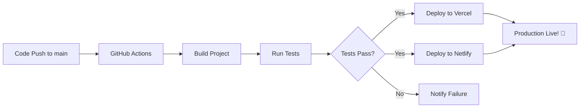

# 🚀 Deployment Guide - YOLMOV

## GitHub Actions Workflows

Bu proje otomatik deployment için GitHub Actions kullanıyor.

### 📋 Workflow'lar

#### 1. **Deploy Workflow** (`deploy.yml`)
- **Tetikleyici:** `main` branch'e push
- **İşlemler:**
  - ✅ Build oluşturma
  - ✅ Vercel'e deploy
  - ✅ Netlify'a deploy
  - ✅ Lint kontrolü

#### 2. **CI Pipeline** (`ci.yml`)
- **Tetikleyici:** Pull Request
- **İşlemler:**
  - ✅ Test build
  - ✅ Type check
  - ✅ Code quality check
  - ✅ Build size raporu

---

## 🔐 Gerekli Secret'lar

GitHub repository Settings > Secrets and variables > Actions bölümünden aşağıdaki secret'ları ekleyin:

### Vercel Secrets

1. **VERCEL_TOKEN**
   - Vercel Dashboard > Settings > Tokens
   - "Create Token" ile yeni token oluşturun

2. **VERCEL_ORG_ID**
   - Vercel projenizin `.vercel` klasöründe bulunur
   - Veya Vercel Dashboard > Settings > General

3. **VERCEL_PROJECT_ID**
   - Vercel projenizin `.vercel` klasöründe bulunur
   - Veya proje settings'den alabilirsiniz

### Netlify Secrets

1. **NETLIFY_AUTH_TOKEN**
   - Netlify Dashboard > User Settings > Applications
   - "New access token" oluşturun

2. **NETLIFY_SITE_ID**
   - Netlify Site Settings > General > Site details
   - "API ID" kısmından kopyalayın

---

## 📦 Vercel Deploy (Manuel)

```bash
# Vercel CLI yükleyin
npm i -g vercel

# Login olun
vercel login

# Deploy edin
vercel --prod
```

---

## 🌐 Netlify Deploy (Manuel)

```bash
# Netlify CLI yükleyin
npm i -g netlify-cli

# Login olun
netlify login

# Deploy edin
netlify deploy --prod --dir=dist
```

---

## 🔄 Otomatik Deploy Akışı



---

## ⚙️ Build Komutları

```bash
# Development
npm run dev

# Production build
npm run build

# Preview build
npm run preview

# Lint
npm run lint
```

---

## 📊 Deploy Sonrası Kontroller

### ✅ Checklist
- [ ] Ana sayfa yükleniyor mu?
- [ ] Statik asset'ler (resimler, iconlar) görünüyor mu?
- [ ] Routing çalışıyor mu? (404 sayfası)
- [ ] LocalStorage çalışıyor mu?
- [ ] PWA manifest yükleniyor mu?
- [ ] Mobile responsive görünüm düzgün mü?
- [ ] Admin paneli `/operasyon` URL'i çalışıyor mu?
- [ ] Form validasyonları aktif mi?

---

## 🐛 Sorun Giderme

### Build Hatası
```bash
# Cache temizle
rm -rf node_modules package-lock.json
npm install
npm run build
```

### Deploy Hatası
- GitHub Actions logs'u kontrol edin
- Secret'ların doğru girildiğinden emin olun
- Vercel/Netlify dashboard'larından log'ları inceleyin

### Environment Variables
Eğer `.env` dosyası kullanıyorsanız:
- Vercel: Settings > Environment Variables
- Netlify: Site Settings > Build & Deploy > Environment

---

## 📈 Performance Monitoring

Deploy sonrası performans metrikleri:
- **Lighthouse Score:** 90+ hedefleyin
- **First Contentful Paint (FCP):** < 1.8s
- **Largest Contentful Paint (LCP):** < 2.5s
- **Time to Interactive (TTI):** < 3.8s

---

## 🔗 Faydalı Linkler

- [Vercel Documentation](https://vercel.com/docs)
- [Netlify Documentation](https://docs.netlify.com)
- [GitHub Actions Documentation](https://docs.github.com/en/actions)
- [Vite Build Guide](https://vitejs.dev/guide/build.html)

---

**Son Güncelleme:** 26 Kasım 2025
